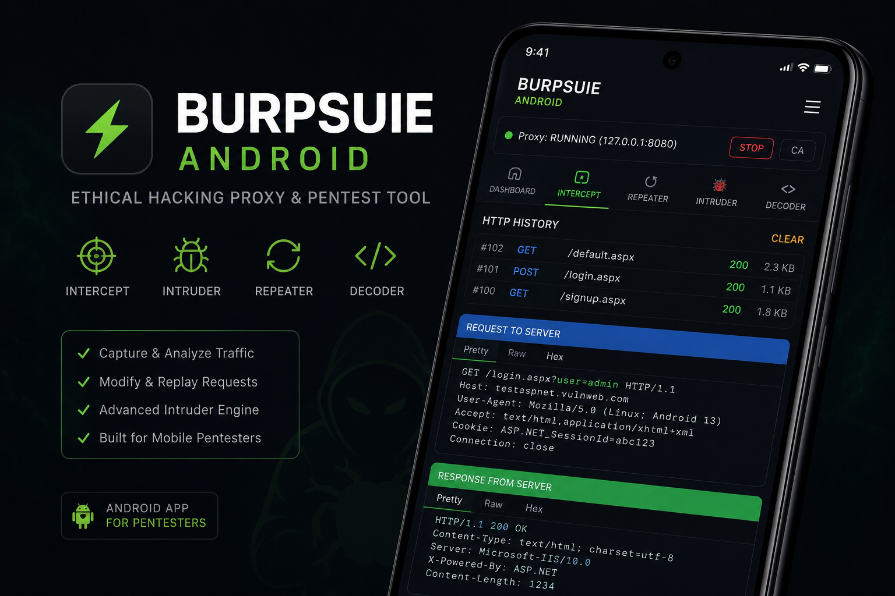

# Ethical Hacking Burp

Web tool yang meniru fitur inti Burp Suite: **Proxy + Intercept**,
**Repeater**, **Intruder**, dan **Decoder** — dibungkus tampilan web GUI
gelap ala Burp mobile, jalan di **localhost** lewat browser. Didesain
enteng buat **Termux** (Android) maupun desktop biasa.

**Author:** ZamurSec
**Discord:** https://discord.com/invite/AA92kB5GSB

> ⚠️ **Gunakan hanya pada sistem yang kamu miliki atau punya izin eksplisit
> untuk diuji** (lab CTF, environment lokal, situs uji resmi seperti
> vulnweb.com, atau program bug bounty dengan scope jelas). Mencegat/
> memodifikasi traffic pihak lain tanpa izin adalah tindak pidana di
> sebagian besar yurisdiksi.

<p align="center">
  
</p>

## Fitur

- **Proxy HTTP & HTTPS** (MITM via Root CA yang di-generate sendiri, sama
  seperti cara kerja Burp/mitmproxy)
- **Intercept**: tahan request, lihat, edit raw, forward atau drop —
  auto-forward semua yang tertahan begitu Intercept dimatikan
- **HTTP History**: semua request/response tersimpan di SQLite
  (`history.db`), dengan filter per-host dan pagination 15 item/halaman
- **Repeater**: ambil request dari history, edit manual, kirim ulang
- **Intruder**: sniper attack pakai marker `§PAYLOAD§`, multi-thread,
  hasil bisa diekspor ke CSV
- **Decoder**: URL / Base64 / Hex encode-decode
- Auto dechunk + decompress (gzip/deflate/br) + deteksi charset
  (UTF-8/Windows-1252/ISO-8859-1) biar response nampil bersih, bukan
  bytes mentah

## Instalasi & Jalanin

### Di Termux

```bash
pkg install git
git clone https://github.com/zamurpy/BurpSuiteAndroid
cd BurpSuiteAndroid
pip install -r requirements.txt
python app.py
```

### Di Linux/Mac/WSL/Desktop biasa

```bash
git clone https://github.com/zamurpy/BurpSuiteAndroid
cd BurpSuiteAndroid
pip install -r requirements.txt
python3 app.py
```

Lalu buka **http://127.0.0.1:5000** di browser (di Termux, buka browser HP-nya —
localhost tetap bisa diakses karena satu device yang sama).

## Cara Pakai

1. Klik **START** di status bar buat nyalain proxy (default `127.0.0.1:8080`)
2. Set proxy HTTP & HTTPS di device/browser/app target ke `127.0.0.1:8080`
3. Untuk intercept **HTTPS tanpa warning cert**, klik **CA** di status bar,
   install Root CA `.pem`-nya sebagai Trusted CA di device/browser yang
   traffic-nya diuji (hanya device milikmu sendiri untuk keperluan testing)
4. Toggle **Intercept ON** buat nahan tiap request → edit/forward/drop
5. Buka tab **History**, pakai dropdown host buat filter per-target
6. Klik entry di History → **↺ To Repeater** atau **🐞 To Intruder** buat
   lanjut analisis

## Keterbatasan

- Baru attack mode Sniper di Intruder (belum Cluster Bomb/Battering Ram)
- UI web ringan, gak ada fitur scan otomatis/plugin ala Burp Pro
- Transfer-Encoding chunked & Content-Encoding gzip/deflate udah dihandle;
  Brotli (`br`) perlu modul `brotli` tambahan (`pip install brotli`)

  <p align="center">
  
</p>

## Struktur File

```
ehburp/
├── app.py           # Flask backend + routing web UI
├── proxy.py         # proxy server (HTTP/HTTPS) + intercept
├── certauth.py       # generate Root CA & cert per-host
├── db.py             # penyimpanan history (SQLite)
├── repeater.py        # kirim ulang / edit request
├── intruder.py         # fuzzing attack
├── decoder.py           # URL/Base64/Hex encode-decode
├── httputil.py           # dechunk, decompress, deteksi charset
├── static/
│   ├── index.html         # halaman utama
│   ├── style.css            # tema dark ala Burp mobile
│   └── app.js                 # logic frontend
├── requirements.txt
├── install_termux.sh
└── LICENSE            # All Rights Reserved - lihat sebelum redistribusi
```

## Lisensi

Source-available, **All Rights Reserved** — lihat file `LICENSE`. Boleh
dipakai buat testing pribadi/edukasi, tapi **gak boleh diredistribusi,
dimodifikasi, atau diklaim jadi karya orang lain** tanpa izin tertulis dari
ZamurSec. gabung Discord:
https://discord.com/invite/AA92kB5GSB
